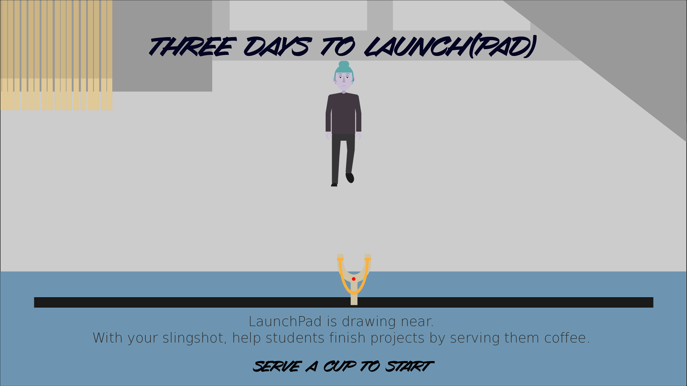
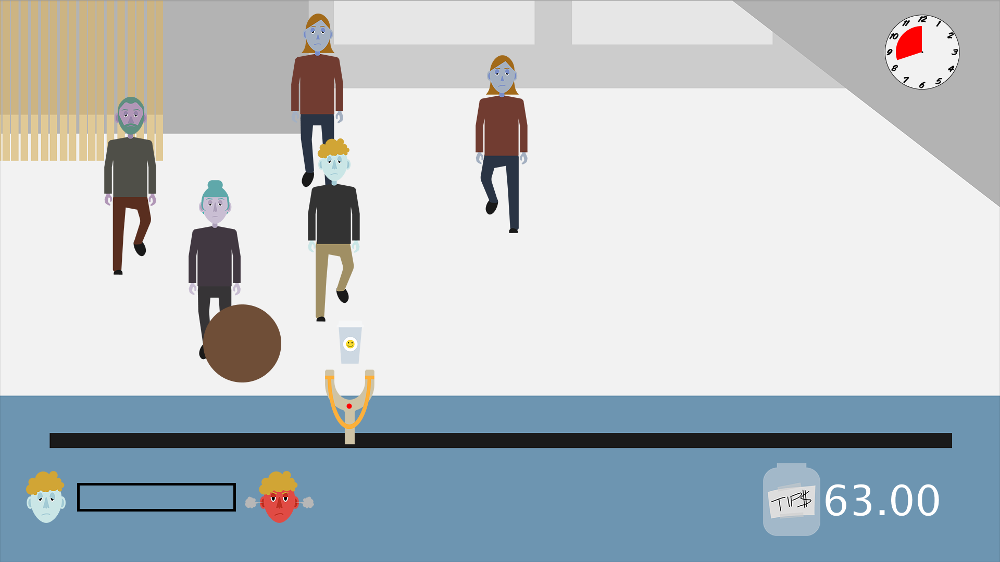
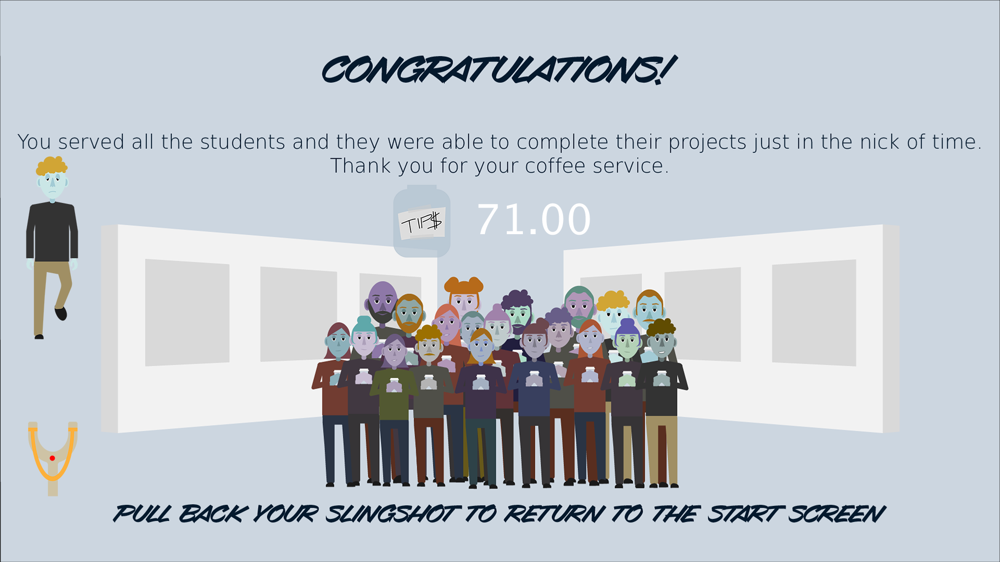

# Three Days to Launch(pad)

A game built in Processing and Arduino and played with a custom built physical controller.

Programming and Design - Chunlok Lo  Art - Grace Gaspardo Physical controller design and fabrication - Cheyenne Baker, Trevor Hyman

[Video Demo](https://www.youtube.com/watch?v=xDo9BJ58l6I)

### Some Screenshots:

